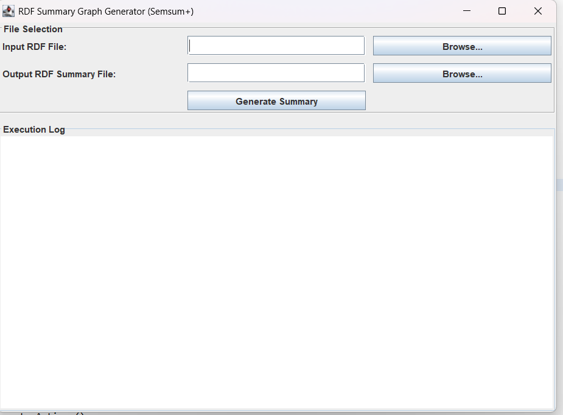

# RDF Graph Summarization Based on Approximate Patterns (SemSum+)

This project provides a Java-based implementation of **RDF graph summarization** using **approximate pattern mining** techniques. It includes a **GUI tool** to load RDF files, summarize them using the **PaNDa+** algorithm, and export the summary as an RDF file.

---

## 📘 Description

**SemSum+** (Approximate Pattern-based RDF summarization) efficiently detects frequent approximate patterns in RDF datasets, generating a concise and meaningful **summary graph**.

This implementation uses:
- **Jena** to parse and manipulate RDF files
- **Matrix-based transformation** of RDF data
- **Top-K approximate pattern mining** based on the PaNDa+ algorithm
- A built-in **Java Swing GUI**

---

## 📄 Abstract

> RDF data is typically noisy, redundant, and voluminous, making it difficult to manage, interpret, and use effectively. To address these issues, we propose an RDF summarization technique based on approximate pattern mining. Our method applies the PaNDa+ algorithm to discover top-k approximate patterns that identify groups of similar subjects sharing similar properties. These patterns are then used to generate a summary graph that preserves the semantics of the original RDF data while significantly reducing its size and complexity. Our approach balances the trade-off between accuracy and compression and scales well with large datasets.

---

## 🧠 Citation

If you use this tool in your research, please cite:

> **RDF Graph Summarization Based on Approximate Patterns**  
> Mussab Zneika, Claudio Lucchese, Dan Vodislav, Dimitris Kotzinos

---

## 📸 GUI Screenshot



---

## 🛠 Features

- Load RDF files (.ttl, .rdf)
- Visual interface to select input/output files
- Configurable parameters (K, ε_row, ε_col)
- Automatic generation of:
  - Summary graph (RDF)
  - Pattern outputs
  - Predicate/subject mapping
- Optional console logging

---

## 🚀 Usage

### 📦 Requirements

- Java 8+
- Maven (or manual classpath configuration)
- Git (to clone the repo)

### ▶️ Running the GUI

```bash
cd RDF-Graph-Summarization-Based-on-Approximate-Patterns
javac -cp ".;lib/*" www/etis_midi/fr/panda/main/MainGUI.java
java -cp ".;lib/*" www.etis_midi.fr.panda.main.MainGUI
````

Replace `;` with `:` for Linux/macOS.


## 🔍 Parameters

* `K`: Number of top patterns to extract (default: 100)
* `ε_row`, `ε_col`: Row and column error thresholds (default: 0.6)

---

## 🧹 Troubleshooting

### Q: GitHub says my file is too large!

**A:** Avoid committing RDF files larger than 100MB. Use `.gitignore` or Git LFS if needed.

### Q: Can't push to GitHub after force-push?

**A:** Try:

```bash
git pull --rebase origin main
# Or reset and force-push only your desired content
```

---

## 🤝 Contributing

Feel free to fork and submit a pull request if you'd like to:

* Improve the GUI design
* Add parameter inputs to the GUI
* Extend the summarization logic
* Convert this to a web-based interface

---

## 📜 License

This project is open-source. License can be added here (e.g., MIT, Apache-2.0).
